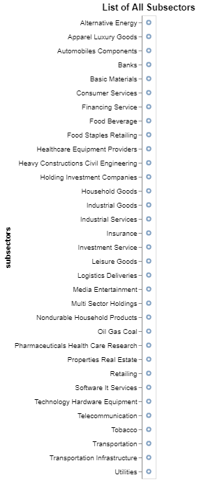

# List of All Subsectors

## Install required libraries

- Install the [requests](https://requests.readthedocs.io/en/latest/) library to make HTTP Requests

- Install [pandas](https://pypi.org/project/pandas/) to do some data exploratory
- In this recipe we will use [altair](https://pypi.org/project/matplotlib/) to do the data visualization, if you are unfamiliar with altair, try to watch this playlist [Altair Tutorial](https://youtube.com/playlist?list=PLXsFtK46HZxXBddVC0FqmbGdlvbDbaqzx&si=cWtD0cFtwKg0b75v)

```{python}
pip install requests pandas altair
```

## Accessing List of All Subsectors

Let's try to obtain the access token to be used in this recipe and import all the required libraries

```python
import requests
import pandas as pd
import altair as alt

url = "https://sectors-api.fly.dev/api/token/"

body = {
"email":  "YOUR_EMAIL",
"password":  "YOUR_PASSWORD"
}

response = requests.post(url, json = body)

if response.status_code == 200:
	data = response.json()
	access_token = data["access"]
else:
	# Handle error
	print(response.status_code)
```

Next steps lets try to retrieve list of all subsectors using the `access_token`

```python
headers = {
    "Authorization": f"Bearer {access_token}"
}
response = requests.get("https://sectors-api.fly.dev/api/data/subsectors/", headers = headers)

if response.status_code == 200:
	data_all_subsectors = response.json()
else:
	# Handle error
	print(response.status_code)
```

If you try to print the `data_all_subsectors` you'll see a list that look like this

```
['financing-service',
 'insurance',
 'retailing',
 '...']
```

## Data Processing

#### Transforming data to Pandas DataFrame

Before doing data visualization, lets use pandas data frame to get to know our data better!

```python
# For your information the response data type is a list
df = pd.DataFrame(data_all_subsectors, columns=["subsectors"])
df.head()
```

<br>

The results will look like the following

<br>

|     | subsectors                    |
| --- | ----------------------------- |
| 0   | financing-service             |
| 1   | insurance                     |
| 2   | retailing                     |
| 3   | transportation-infrastructure |
| 4   | food-staples-retailing        |

#### Processing the data

As you can see, the subsectors naming standard is not user friendly, lets fix that too before doing the visualization, you just need to add two lines of code to make it more readable!

```python
df["subsectors"] = df["subsectors"].str.replace("-"," ")
df["subsectors"] = df["subsectors"].str.title()
df.head()
```

After the data processing, now it should look more readable

|     | subsectors                    |
| --- | ----------------------------- |
| 0   | Financing Service             |
| 1   | Insurance                     |
| 2   | Retailing                     |
| 3   | Transportation Infrastructure |
| 4   | Food Staples Retailing        |

## Data Visualization

Now lets try to visualize all the subsectors using altair.

```python
alt.Chart(df).mark_point().encode(
  y='subsectors',
).properties(
    title = 'List of All Subsectors'
)
```



Well as you can see we basically just visualize a list of all subsectors :confused: . Don't worry, lets hop to the next recipe where we will combine the list of all subsectors with list of companies by subsectors to make a great visualization!
