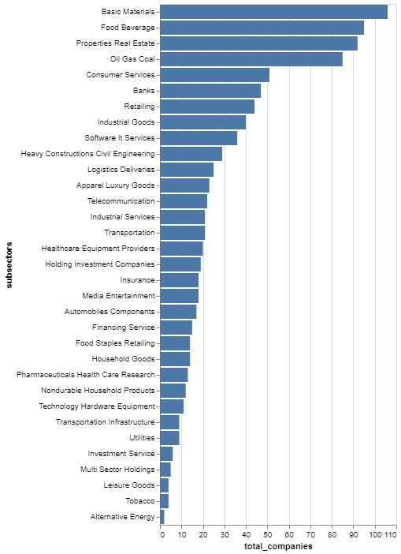
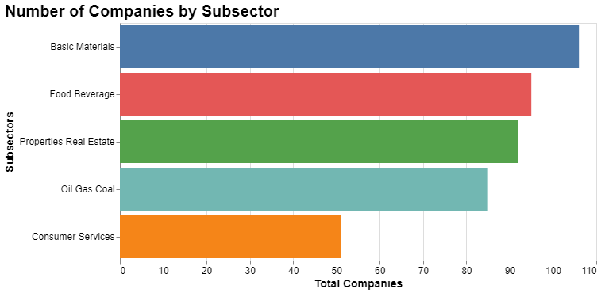

# List of All Subsectors

## Install required libraries

- Install the [requests](https://requests.readthedocs.io/en/latest/) library to make HTTP Requests

- Install [pandas](https://pypi.org/project/pandas/) to do some data exploratory
- In this recipe we will use [altair](https://pypi.org/project/matplotlib/) to do the data visualization, if you are unfamiliar with altair, try to watch this playlist [Altair Tutorial](https://youtube.com/playlist?list=PLXsFtK46HZxXBddVC0FqmbGdlvbDbaqzx&si=cWtD0cFtwKg0b75v)

```{python}
pip install requests pandas altair
```

## Accessing List of All Subsectors

Let's try to obtain the access token to be used in this recipe and import all the required libraries

```python
import requests
import pandas as pd
import altair as alt

url = "https://sectors-api.fly.dev/api/token/"

body = {
"email":  "YOUR_EMAIL",
"password":  "YOUR_PASSWORD"
}

response = requests.post(url, json = body)

if response.status_code == 200:
	data = response.json()
	access_token = data["access"]
else:
	# Handle error
	print(response.status_code)
```

Next steps lets try to retrieve list of all subsectors using the `access_token`

```python
headers = {
    "Authorization": f"Bearer {access_token}"
}
response = requests.get("https://sectors-api.fly.dev/api/data/subsectors/", headers = headers)

if response.status_code == 200:
	data_all_subsectors = response.json()
else:
	# Handle error
	print(response.status_code)
```

If you try to print the `data_all_subsectors` you'll see a list that look like this

```
['financing-service',
 'insurance',
 'retailing',
 '...']
```

## Data Processing

### Transforming data to Pandas DataFrame

Before doing data visualization, lets use pandas data frame to get to know our data better!

```python
# For your information the response data type is a list
df = pd.DataFrame(data_all_subsectors, columns=["subsectors"])
df.head()
```

<br>

The results will look like the following

<br>

|     | subsectors                    |
| --- | ----------------------------- |
| 0   | financing-service             |
| 1   | insurance                     |
| 2   | retailing                     |
| 3   | transportation-infrastructure |
| 4   | food-staples-retailing        |

### Processing the data

As you can see, the subsectors naming standard is not user friendly, lets fix that too before doing the visualization, you just need to add two lines of code to make it more readable!

```python
df["subsectors"] = df["subsectors"].str.replace("-"," ")
df["subsectors"] = df["subsectors"].str.title()
df.head()
```

After the data processing, now it should look more readable

|     | subsectors                    |
| --- | ----------------------------- |
| 0   | Financing Service             |
| 1   | Insurance                     |
| 2   | Retailing                     |
| 3   | Transportation Infrastructure |
| 4   | Food Staples Retailing        |

## Data Visualization
Now lets try to visualize all the subsectors using altair!

### Lets look at another API

The list of all subsectors API only returns a list of subsectors, which we cannot really get insights from it, now if we take a look, there is another API called `List of Companies by Subsector`. This API allows us to get a list of company from specific subsector, now lets try to retrieve the data and do some meaningful visualization using altair.

### Collect the data

Lets join the data from both API to a single list using the code below

```python
data = []
for sector in data_all_subsectors:
    headers = {
    "Authorization": f"Bearer {access_token}"
    }
    response = requests.get(f"https://sectors-api.fly.dev/api/data/companies/?sub_sector={sector}", headers = headers)

    if response.status_code == 200:
        list_companies_by_subsectors = response.json()
        for company in list_companies_by_subsectors:
            data.append([sector, company])
    else:
        # Handle error
        print("Error Status :",response.status_code)
print(data)
```

The code above basically retrieve all the list of companies from all subsectors, if you run the code. You should be able to see the output like below

```
[['financing-service', 'BFIN.JK'],
 ['financing-service', 'CFIN.JK'],
 ['financing-service', 'WOMF.JK'],
 ['insurance', 'LIFE.JK'],
 ['insurance', 'ASRM.JK'],
...
 ['healthcare-equipment-providers', 'PRIM.JK']]
 ```

Now since we already join the data lets do some data processing and visualize the data

### Total Companies by Subsector

In this recipe, lets visualize Total Companies by Subsector using the data that we already have. First step is lets clean our data using the same way and group the data by subsector so we can get the count of companies by each subsector.

```python
df = pd.DataFrame(data, columns=["subsectors", "company"])
df["subsectors"] = df["subsectors"].str.replace("-"," ")
df["subsectors"] = df["subsectors"].str.title()
df_grouped = df.groupby('subsectors').size().reset_index(name="total_companies")
```

The code above will make the subsectors more readable and group the data by subsectors and get the total companies on each subsector. Run this code below to see the output.

```python
df_grouped.head()
```

|     | subsectors                    | total_companies|
| --- | ----------------------------- | --- |
| 0   | Alternative Energy            | 2   |
| 1   | Apparel Luxury Goods	      | 23  |
| 2   | Automobiles Components	      | 17  |
| 3   | Banks                         | 47  |
| 4   | Basic Materials               | 106 |

### Lets visualize it!

Now lets do the most basic visualization using altair, lets simply do a bar chart to see total companies of each subsector.

```python
chart = alt.Chart(df_grouped).mark_bar().encode(
    x='total_companies',
    y=alt.Y('subsectors', sort='-x')
)

chart.display()
```



Well now we have done a very basic bar chart visualization using altair, but it looks really long and messy! :laughing: Lets reduce the number to be top 5 biggest subsector by company and do some adjustment on the visualization.

### Top 5 Biggest Subsector by Company
```python
df_grouped = df_grouped.sort_values(by="total_companies", ascending=False)
top_five_subsectors = df_grouped.head(5)
```


### A Better visualization!

```python
chart = alt.Chart(top_five_subsectors).mark_bar().encode(
    y=alt.Y("subsectors", sort="-x", title="Subsectors"),
    x=alt.X("total_companies", title="Total Companies"),
    color=alt.Color('subsectors:N', legend=None)  # Optional: remove the legend if it's redundant
).properties(
    title='Number of Companies by Subsector',
    width=600,
    height=300
)

# Configure overall visual theme
chart = chart.configure_title(fontSize=20, anchor='start', color='black').configure_axis(
    labelFontSize=12,
    titleFontSize=14
)

chart.display()
```


And now we have a much better visualization that we can show to our boss! :wink:

Now we have pull the data from [Sectors](https://www.sectors.app) and do a little bit data processing and visualize the data! Now you can take a look at another API and try to build your own visualization based on your needs or you can simply follow along this cookbook and grab more insights with us!