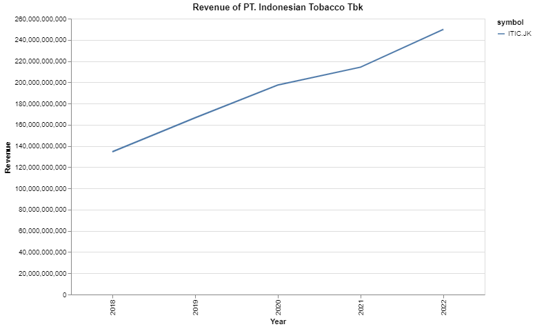
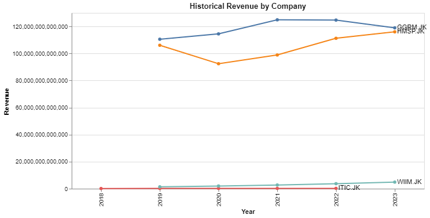
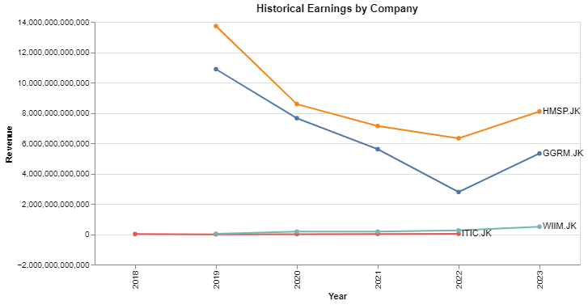

# Company Revenue Analysis by Subsectors

Suppose you have some spare cash—often referred to as "cold money"—that you're looking to invest, particularly in the tobacco subsector, with a focus on company's financial. Naturally, you would need to examine the historical financial data of each potential investment, right? Well, relax; there's no need to go through this process manually. With the [Sectors API](https://www.sectors.app/api), you can effortlessly access and visualize the necessary data!

## Install Required Libraries
- Install the [requests](https://requests.readthedocs.io/en/latest/) library to make HTTP Requests
- Install [pandas](https://pypi.org/project/pandas/) to do some data exploratory
- In this recipe we will use [altair](https://pypi.org/project/matplotlib/) to do the data visualization, if you are unfamiliar with altair, try to watch this playlist [Altair Tutorial](https://youtube.com/playlist?list=PLXsFtK46HZxXBddVC0FqmbGdlvbDbaqzx&si=cWtD0cFtwKg0b75v)
- This is not a library, but you will need your [API Keys](https://www.subsectors.app/api) for this recipe

```python
pip install requests pandas altair
```

## Data Exploration
In this recipe we will use a few API from Sectors, here are the following API:

- List of Companies by Subsector API to retrieve all the companies in a subsector
- Individual Company Report per Section API to retrieve the financial data for each company

Using this API we will get the data we need and do some nice visualization on it. You should take a look at [List All Subsectors Recipe](./01_list_all_subsectors.md) also if you need a simple example of data exploration on Sectors Api.

### List all company by subsectors
Lets take a look at list of companies under the tobacco subsectors

```python
import requests
import altair as alt
import pandas as pd

API_KEYS = "Your API Keys"
headers = {
    "Authorization": API_KEYS
}
response = requests.get("https://sectors-api.fly.dev/api/data/companies/?sub_sector=tobacco", headers = headers)

if response.status_code == 200:
    list_companies_by_subsectors = response.json()
    print(list_companies_by_subsectors)
else:
	# Handle error
	print("Error Status :",response.status_code)
```

You should see an output like this
```
['HMSP.JK', 'ITIC.JK', 'GGRM.JK', 'WIIM.JK']
```

These are the list of all companies under one subsectors which in this recipe, we use tobacco subsectors.

### Individual Company Report Per Section
After retrieving the list of companies under the tobacco subsector, the next step is to obtain the financial report for each company. With the help of the [Sectors](www.sectors.app), you can easily access the Company Report, which provides comprehensive information beyond just financial. The available sections of the report include

- Overview
- Valuation
- Peers
- Future
- Financials
- Dividend
- Management
- Ownership

But in this section, we will only cover the financials section, specifically the revenue and earning data, lets retrieve the data and merge it into our previous data.

```python
data = []
for company in list_companies_by_subsectors:
    headers = {
        "Authorization": API_KEYS
    }
    response = requests.get(f"https://sectors-api.fly.dev/api/data/company/report/{company}/?sections=financials", headers = headers)

    if response.status_code == 200:
        financial_report = response.json()
        for historical_financial in financial_report['financials']['historical_financials']:
            data.append([company,financial_report['company_name'], historical_financial['year'], historical_financial['revenue'], historical_financial['earnings']])
    else:
        # Handle error
        print(response)
```

If you run the code and try to print the `data` the output should look like this
```
[['HMSP.JK', 'HM Sampoerna Tbk', 2019, 106055176000000, 13721513000000],
 ['HMSP.JK', 'HM Sampoerna Tbk', 2020, 92425210000000, 8581378000000],
 ['HMSP.JK', 'HM Sampoerna Tbk', 2021, 98874784000000, 7137097000000],
 ['HMSP.JK', 'HM Sampoerna Tbk', 2022, 111211321000000, 6323744000000],
 ...,
 ['ITIC.JK', 'PT Indonesian Tobacco Tbk.', 2019, 166565000000, -7000000000],
 ['ITIC.JK', 'PT Indonesian Tobacco Tbk.', 2020, 197414000000, 6120000000]]
```

Now lets transform the data to pandas dataframe so we can do further analysis and visualization to it.

```python
df = pd.DataFrame(data, columns=['symbol','company_name','year','revenue','earnings'])
```

We now have access to both revenue and earnings data through a single API provided by Sectors! Sectors simplifies the process of retrieving each company's financial report. To explore the breadth of available data, you can interact with the API directly.

## Data Visualization

Since we already gathered the revenue and earnings data from each company, now lets try to visualize and compare the revenue and earnings data from each company

### Revenue Comparison

Lets take a look at a single company revenue first and try to visualize it.

```python
df_filtered = df[(df['symbol'] == 'ITIC.JK')]

chart = alt.Chart(df_filtered).mark_line().encode(
    x=alt.X('year:O', title="Year"),
    y=alt.Y('revenue:Q', title="Revenue"),
    color='symbol'
).properties(
    title='Revenue of PT. Indonesian Tobacco Tbk',
    width=600,
    height=400
).interactive()

chart.display()
```


Now we can see that PT Indonesian Tobacco Tbk have a consistent increase in the revenue, this is a good insight. Now lets take a look at the bigger picture, lets compare all the company in Tobacco Subsector and also make it much prettier.

```python
chart = alt.Chart(df)

line = chart.mark_line(point=True).encode(
    x="year:O",
    y="revenue:Q",
    color = alt.Color("symbol").legend(None),
    tooltip = ["year", "revenue:Q"]
).properties(
    title='Historical Revenue by Company',
    width=600,
    height=300
)

# Use the `argmax` aggregate to limit the dataset to the final value
label = chart.encode(
    x=alt.X('max(year):O', title="Year"),
    y=alt.Y('revenue:Q', title="Revenue").aggregate(argmax='year'),
    text='symbol'
)

# Create a text label
text = label.mark_text(align='left', dx=4)

# Draw the chart with all the layers combined
line + text
```


Upon comparing the revenue of all companies, it's evident that Gudang Garam Tbk consistently outperforms with the highest revenue. This valuable insight could significantly enhance your investment decision-making process.

### Earning Comparison

To compare earnings between companies, you can easily modify the previous code by replacing `revenue` with `earnings`. We won't repeat the code here as it remains largely the same, and we trust in your ability to make this straightforward change.



We see, that HM Sampoerna Tbk consistently have the highest earning compared to all companies

## Conclusion
The Sectors app simplifies the process of retrieving company data. We've demonstrated its use by visualizing and comparing company revenue and earnings. However, the Sectors API offers much more. This is merely an example of its potential; there's a wealth of data at your disposal. Feel free to explore and utilize it according to your needs.