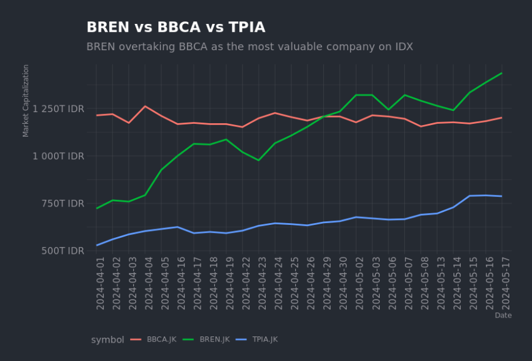

# The tools: `ggplot2` and `httr`
`ggplot2` is a fantastic package for creating visualizations in R, following the Grammar of Graphics philosophy by Leland Wilkinson (where the double 'g' in 'ggplot' comes from).

You should be familiar with the basics of R to make the most out of this series, but prior experience with `ggplot2` isn't expected. Like R, packages such as `ggplot2` and `httr` are open-source and free to use. 

We'll also use `httr` to make HTTP requests to the Sectors API. Acting as a wrapper around the `curl` package, it exposes a simple and consistent set of http verbs like `GET`, `POST`, `PUT`, and `DELETE` to interact with modern web APIs.

## Checklist 
To make the most out of this recipe, ensure you have met the following requirements:
- [ ] R installed on your machine
- [ ] RStudio (recommended) or an IDE of your choice
- [ ] `ggplot2`, `httr`, and `jsonlite` packages installed
    - In R, installing a package is as simple as running `install.packages("package_name")`, e.g., `install.packages("ggplot2")`
- [ ] Valid API keys from Sectors API, which you can acquire from your [Sectors App](https://sectors.app/api) account


# Background: Barito Renewables (BREN) makes history
We'll be visualizing the stock price of Barito Renewables (BREN) and Bank Central Asia (BBCA) from the Indonesia Stock Exchange (IDX). BREN is a renewable energy company that has seen a meteoric rise in the past year, while BBCA is consistently the largest company in Indonesia by market capitalization.

Barito Renewables (BREN) significant rise is noteworthy for many reasons:
- It is now a $90 billion USD company (BBCA is ~$75 billion USD), and together, BREN and BBCA make up more than 20% of the entire IDX market capitalization
- As it overtakes BBCA in market capitalization, it is now the largest company in Indonesia and the first company to topple BBCA since 2017. In other words, the last time BBCA wasn't the most valuable company was 7 years ago -- it has never lost its number 1 spot since then, pointing to the banking giant's dominance and longevity in the Indonesian financial market
- BREN opened at IDR975 on its first day of trading on IDX (2023-10-09), but has since recorded an astounding 1002.56% increase to IDR10,750 as of 2024-05-17. This is a remarkable feat for a company that has only been listed for less than a year
- Barito Renewables is now worth more than the 5 largest Malaysian companies combined (Maybank, Public Bank, CIMB, Tenaga Nasional, Petronas), collectively 22% of the Malaysian stock market
- Sectors have a comprehensive stock report on BREN and BBCA, which you can access here:
    - [Barito Renewables (BREN) Stock Report](https://sectors.app/idx/BREN)
    - [Bank Central Asia (BBCA) Stock Report](https://sectors.app/idx/BBCA)

In the following sections, we'll plot the stock prices of BREN and BBCA to visualize the historic moment when BREN became the most valuable company on IDX.

## From Sectors API to R's data frame

In R, you typically load the libraries you need at the beginning of your script. Here, we'll load `httr` and `jsonlite` to make HTTP requests and parse JSON responses, respectively, along with `ggplot2` for data visualization.

```R
library(httr)
library(jsonlite)
library(ggplot2)
```

You can then make a GET request to the Sectors API to retrieve the stock price data for BREN and BBCA. Sectors API documentation provides the following endpoint to get the stock price data for a specific stock (using `BBCA` as an example):

```
GET https://api.sectors.app/api/data/daily/BBCA/?start=2024-04-01&end=2024-05-15
```

You can replace `BBCA` with `BREN` to get the stock price data for Barito Renewables. The `start` and `end` parameters specify the date range for the data you want to retrieve. Your header should include the `Authorization` key with your API key as the value.

```R
API_KEY <- "Your API Key"
headers <- add_headers(Authotization=API_KEY)
symbol <- "BBCA" # or "BREN"

# use paste0 to form the endpoint URL
url <- paste0("https://api.sectors.app/api/data/daily/",symbol,"/?start=2024-04-01&end=2024-05-15")
response <- GET(url, headers)
```

The `response` object contains the data you requested. You can extract the JSON content from the response using `content(response, "text")` and parse it into a data frame using `fromJSON()` from the `jsonlite` package. A 200 status code indicates a successful request.

To iterate through the stocks you want to retrieve, you can use a loop or a function. Here's how our code might look like if we were to retrieve the stock price data for both BREN and BBCA. For the purpose of this recipe, I've added Chandra Asri (trading under the symbol `TPIA`), third-largest company on IDX after BREN and BBCA. 

```R
# initialize data frame
df_daily <- data.frame()

for (i in c("BBCA","BREN", "TPIA")){
  url <- paste0("https://api.sectors.app/api/data/daily/",i,"/?start=2024-04-01&end=2024-05-18")
  response <- GET(url, headers)
  
  if (status_code(response) == 200) {
      df <- fromJSON(content(response, "text"),flatten=TRUE)
      df_daily <- rbind(df_daily,df)
    } else {
      # Handle error if request fails
      cat("Error:", status_code(response), "\n")
      next
    }
}
```

Your `df_daily` data frame should now contain the stock price data for BREN, BBCA and TPIA. You can use `tail(df_daily)` to view the last few rows of the data frame:

```R
tail(df_daily)
```

Returns:
```R
47	BREN.JK	2024-05-08	9650	12895300	1.291035e+15
48	BREN.JK	2024-05-13	9450	12510700	1.264278e+15
49	BREN.JK	2024-05-14	9275	11060200	1.240865e+15
50	BREN.JK	2024-05-15	9975	32641300	1.334515e+15
51	BREN.JK	2024-05-16	10375	25578300	1.388030e+15
52	BREN.JK	2024-05-17	10750	33916900	1.438199e+15
```


## Visualizing stock prices of BREN vs BBCA
Now that we have the stock price data for BREN and BBCA, we can use `ggplot2` to create a line plot that visualizes the stock prices over time. We'll plot the closing price of BREN and BBCA on the same graph to compare their performance over the selected date range.

To assist in the y-axis scaling, I've also loaded the `scales` package to help rescale the market capitalization values. 

```R
library(scales)
ggplot(
  df_daily,
  aes(x=date, y=market_cap, group=symbol, color=symbol)
  ) +
  geom_line(linewidth=1) +
  labs(x = "Date", 
       y = "Market Capitalization", 
       title="BREN vs BBCA vs TPIA",
       subtitle = "BREN overtaking BBCA as the most valuable company on IDX"
       ) +
  scale_y_continuous(
    labels = label_number(
        scale_cut = cut_short_scale(),
        # suffix = " IDR" # optional suffix
    )
  ) +
  theme(axis.text.x = element_text(angle = 90, hjust = 1), 
        legend.position = "bottom",
        legend.justification = "left") 
```

The `ggplot()` function initializes the plot, and the `aes()` function specifies the aesthetics of the plot, including the x-axis (`date`), y-axis (`market_cap`), grouping (`symbol`), and color (`symbol`). 

The `geom_line()` function creates a line plot, and the `labs()` function sets the labels for the x-axis, y-axis, title, and subtitle. Setting `linewidth` to 1 gives the line the right thickness for better visibility.

The `scale_y_continuous()` function rescales the y-axis labels using the `label_number()` function from the `scales` package.

The final layer of the plot is the `theme()` function, which customizes the appearance of the plot. Here, we rotate the x-axis labels by 90 degrees, position the legend at the bottom, and justify the legend to the left.

You should have a line plot that looks like the one below:



## Go beyond
The rest of this series will explore more ways you can combine Sectors API with R's powerful data visualization ecosystem to create insightful and visually appealing plots. You can also explore other endpoints provided by the Sectors API to retrieve different types of data, such as financials, dividends, and stock reports, or even combine data from multiple endpoints to richer narratives.