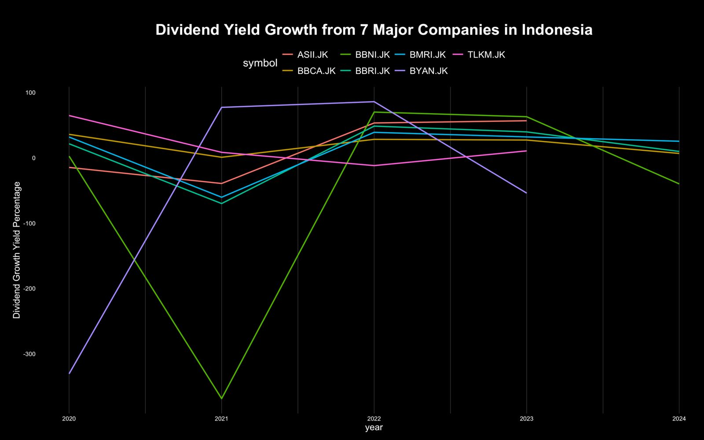

Welcome to the new chapter of [Sector's](https://sectors.app) animation plot series! In the last three chapter we already learned how to create animation plot using bar chart, and scatter plot. Now, let's learn how to do it for line chart. Reminder, we will still use R for this chapter. Also since, some of the charts produce in this series are used in [Sector's Instagram](https://www.instagram.com/sectorsapp/) content, don't forget to follow and support it!

# Dividend Growth Investing Strategy
Before diving into the coding section, it's crucial to understand the dividend growth investing strategy and the key metrics essential for its application in daily stock market activities.

Firstly, let's grasp the concept of dividends. Dividends are profits that a company distributes to its shareholders, indicating financial stability and maturity. Unlike growth-oriented firms that reinvest earnings, dividend-paying companies offer shareholders a portion of their profits.

For investors, dividends offer a reliable source of passive income, particularly appealing to those seeking consistent cash flow from investments. These stocks are often less volatile than non-dividend-paying counterparts, as dividends can mitigate the impact of market downturns. Additionally, dividends significantly contribute to a stock's total return on investment, along with capital appreciation, making them a pivotal element in many portfolios for their income and stability benefits.

Given the numerous advantages of dividends, dividend growth investing has garnered significant respect in the investment realm. This strategy focuses on long-term wealth accumulation and income generation by selecting and holding stocks in companies with a consistent record of increasing dividends annually. Investors using this approach prioritize companies with strong financial health, stable earnings, and a commitment to rewarding shareholders through dividends.

The key advantage of dividend growth investing lies in its ability to provide a growing stream of passive income over time. As companies continue to raise dividends, investors benefit from an increasing income stream, particularly valuable for those aiming to supplement income or build a retirement nest egg.

Moreover, this strategy is viewed as a conservative approach compared to others. By targeting companies with a history of stable dividend growth, investors can potentially reduce exposure to market volatility while benefiting from equities' long-term growth potential. Patience and discipline are vital, as the compounding effects of dividend growth may take time to materialize.

# Plot Creation
Based on the explanation of dividend growth, we must analyze the dividend of each company to know which company is suitable to be bought if we use the dividend growth investing strategy. Therefore, we can use the [Sector's API](https://sectors.app/api) to directly get the dividend of each company. In this recipe, I'll show you the dividend growth analysis of 7 majors companies in Indonesia.

## Data Fetching

```r
library(httr)
library(jsonlite)
library(tidyverse)

# Initialize an empty data frame
df_div <- data.frame()

# Enter Your API Key Here
api_key <- "YOUR API KEY"

# Specify list of stock
stocks <- c("BBCA.JK", "BBRI.JK","BYAN.JK","BMRI.JK", "TLKM.JK", "ASII.JK","BBNI.JK")

# Remove the ".JK" suffix from each string
cleaned_stocks <- sub(".JK", "", stocks)

for (i in cleaned_stocks) {
  # Replace the URL with a URL from the Available Endpoints section
  url <- paste0("https://api.sectors.app/api/data/company/report/", i, "/?sections=dividend")
  
  headers <- c(Authorization = api_key)
  
  response <- GET(url, add_headers(headers))
  
  if (status_code(response) == 200) {
    df <- fromJSON(content(response, "text"),flatten=TRUE)
    df <- df$dividend$historical_dividends
    df$symbol <- paste0(i,".JK")
    
    df <- df %>% select(symbol,year,total_dividend)
    
    df_div <- rbind(df_div,df)
  } else {
    # Handle error
    cat("Error:", status_code(response), "\n")
    next
  }
}

df_div
```

Using the code above, here is the glimpse of the data:

| symbol  | year | total_dividend   |
| ------- | ---- | ---------------- |
| BBCA.JK | 2019 | 71.0000	        |
| BBRI.JK | 2019 | 120.1560	        |
| BYAN.JK | 2019 | 127.0530	        |
| BMRI.JK | 2019 | 120.6080 	    |
| TLKM.JK | 2019 | 54.6075		    |

In case, you haven't had any subscription to [Sector's API](https://sectors.app/api), I put the data (it is sourced from [Sector](https://sectors.app)) in the repository too, and you can used it to code along in this series. But don't forget to subscribe to the [Sector's API](https://sectors.app/api) plan, so you can freely analyze the other companies as you wish!

## Data Manipulation

The other advantages of using the API is the data is already quite clean and we don't need to do a lot of data manipulation especially in this recipe. We only need to calculate the dividend growth per symbol each year and then we can directly make a plot from that data. We can calculate and create a new column for `dividend_growth` value using the code below.

```r
# Shift the 'value' column within each 'symbol' group
df_div <- df_div %>%
  group_by(symbol) %>%
  mutate(shifted_value = lag(total_dividend)) %>% 
  mutate(percentage_growth = round(((total_dividend-shifted_value)/shifted_value)*100,2)) %>% 
  drop_na()
```

and here is the glimpse of the data that are ready to be plotted

| symbol  | year | total_dividend   | shifted_value | percentage_growth |
| ------- | ---- | ---------------- | ------------- | ----------------- |
| BBCA.JK | 2020 | 110.6000 	    | 71.0000	    | 55.77             |
| BBRI.JK | 2020 | 152.9080         | 120.1560	    | 27.26             |
| BYAN.JK | 2020 | 29.5080          | 127.0530	    | -76.78            |
| BMRI.JK | 2020 | 176.6710		    | 120.6080	    | 46.48             |
| TLKM.JK | 2020 | 154.0680 	    | 54.6075	    | 182.14            |

## Data Visualization

In this recipe I also use the custom theme that I created, so you can skip the code below if you don't want to use my theme or already create it from the previous recipe in this series.

```r
custom_theme <- theme(
  axis.line=element_blank(),
  axis.text.x=element_text(color="white",size=10),  # Set x-axis labels to white
  axis.text.y=element_text(color="white",size=10),
  axis.ticks=element_blank(),
  axis.title.x=element_text(color="white",size=15),
  axis.title.y=element_text(color="white",size=15),
  panel.background=element_rect(fill="black"), # Black background
  panel.border=element_blank(),
  panel.grid.major=element_blank(),
  panel.grid.minor=element_blank(),
  panel.grid.major.x = element_line( size=.1, color="grey" ),
  panel.grid.minor.x = element_line( size=.1, color="grey" ),
  plot.title=element_text(size=25, hjust=0.5, face="bold", colour="white", vjust=-1.5, margin=margin(t=2, unit="line")),
  plot.subtitle=element_text(size=18, hjust=0.5, vjust=0,face="italic", color="grey"),
  plot.caption =element_text(size=12, hjust=0.5, face="italic", color="grey"),
  plot.margin = margin(1,1, 1, 1, "cm"),
  plot.background=element_rect(fill="black"),
  legend.background = element_rect(fill = "black"),
  legend.text = element_text(color='white',size=15),
  legend.title = element_text(color='white',size=18),
  legend.key.size = unit(1.5, "lines")
)
```

### Static Plot

```r
library(scales)

plot <- ggplot(
  div,
  aes(year, dividend_growth_percentage, group= symbol,color = factor(symbol))
  ) +
  geom_line(linewidth=1) +
  labs(x = "year", y = "Dividend Growth Yield Percentage") +
  theme(legend.position = "top") +
  scale_fill_manual(values = colors)+
  labs(color = "symbol")+
  ggtitle("Dividend Yield Growth from 7 Major Companies in Indonesia") +
  custom_theme

plot
```

The code above is to create the static line plot and the result is in the image below



### Animation Plot
To make the plot more lively and more interesting, we can use the animation, we can shown the line chart each year one by one using the code below and directly save it into .gif file

```r
anim <- plot + 
  geom_point(size=6) +
  geom_text(aes(label=symbol), hjust=-0.1, size=8)+
  transition_reveal(year)
  
animate(anim, 200, fps = 8, width = 1400, height = 1000,
        renderer = gifski_renderer("gganim_10.gif"))
```


Using this plot, we can see which company have a consistent record of increasing dividends annually, and apply your dividend growth investing strategy. If you want to analyze other companies's dividend, you can directly subscribe to the [Sector's API](https://sectors.app/api) subscription plan! Plus you can visit [Sector's Website](https://sectors.app) for other analysis!

See you on the next recipe!
