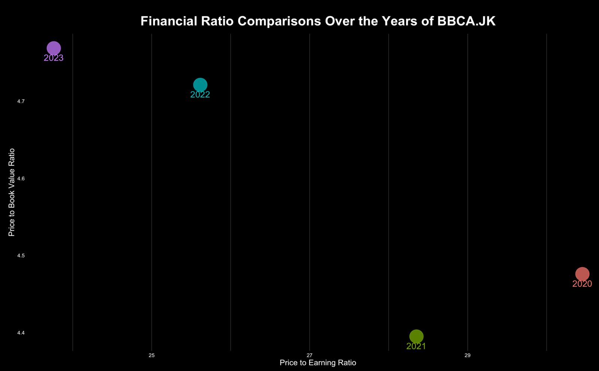
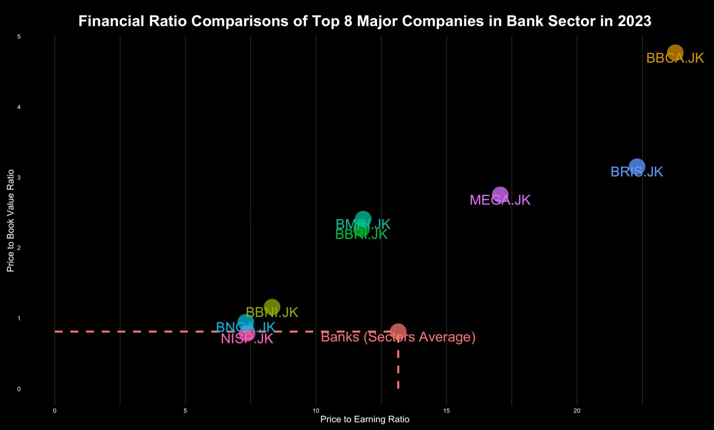

Hello and welcome back to our [Sector's](https://sectors.app) animation plot series! If you haven't already explored our previous recipes and recreated those captivating plots, you're in for a treat. This series is a showcase of creativity, using the dynamic duo of `ggplot` and `gganimate` to craft stunning animated visualizations. These plots aren't just eye candy; they're the content that keeps [Sector's Instagram](https://www.instagram.com/sectorsapp/) account buzzing (make sure to check them out and hit that follow button!). Each plot is based on meticulously curated data from the [Sector's](https://sectors.app) team, providing insightful analysis, particularly focusing on the Indonesia Stock Exchange. So, without further ado, let's dive into the excitement of our third recipe in this animation plot series!

# Financial Ratio Valuation Metrics

In the last two recipes, we already used the market capitalization and transaction volume to do some analysis. In this recipe, we will use financial ratio to do some valuation on each stock price. There are two financial ratio valuation metrics that we will use here which are `Price to Earning Ratio` (PE Value) and `Price to Book Valur Ratio` (PBV).

## PE Value Ratio

The price-to-earnings (P/E) ratio is a metric that evaluates a company's stock price in relation to its earnings per share (EPS). This ratio is crucial for determining the value of a company's stock, as it allows for comparisons of a company's valuation over time, with other companies in the same industry, or with the broader market.

> Example:
> A P/E ratio of 15 means that the company’s current market value equals 15 times its annual earnings.

The P/E ratio serves as a valuable tool for investors to gauge whether a stock is undervalued or overvalues. A high P/E ratio may indicate that the stock is overvalued, suggesting either optimistic growth expectations or inflated market sentiment and vice versa. Additionally, by calculating the median P/E ratio across several years, investors can establish a standardized benchmark to determine a stock's potential worth.

However, a notable limitation of using P/E ratios arises when comparing companies across different sectors. Variations in valuation and growth rates are common among industries due to differences in revenue generation timing and business models, making direct P/E ratio comparisons less reliable.

## PBV Ratio

The price-to-book ratio (P/B ratio) of a company is calculated by dividing its current stock price per share by its book value per share (BVPS). This ratio provides insight into how the market values the company relative to its book value.

> Example A P/B ratio of 1 means that the stock price is trading in line with the book value of the company. In other words, the stock price would be considered fairly valued, strictly from a P/B standpoint.

Typically, a P/B ratio below one suggests that a company is undervalued, whereas a ratio above one suggests that the stock is trading at a premium. However, the significance of these values can vary significantly across industries. Different sectors have their own norms, where lower or higher P/B ratios may be considered typical.

However, the P/B ratio has its limitations. For instance, it does not take into account intangible assets such as intellectual property and brand value, which can be significant in certain industries. As a result, the P/B ratio may not always accurately reflect a company's true value. Furthermore, the P/B ratio may be less relevant for companies with a high proportion of intangible assets, such as technology firms, where the value lies more in ideas and innovations than in physical assets. 

# Plot Creation

After reading about the financial ratios valuation metrics, now we can start to play with the data and create a animated plot to shown the comparisons of the financial valuation metrics (PE and PBV) of some major banks in Indonesia.

## Data fetching

To get the data you can use [Sector's API](https://sectors.app/api) to directly fetch the data from the [Sector's website](https://sectors.app), it will be easier for you to directly ping the API and use the data than curated the data by yourself, so don't forget to subscribe to [Sector's API plan](https://sectors.app/pricing). Here is the code to fetch the historical valuation data using the API.

```r
library(httr)
library(jsonlite)
library(tidyverse)

# Initialize an empty data frame
df_finance <- data.frame()

# Specify list of stock
stocks <- c("BBCA.JK", "BBRI.JK", "BMRI.JK", "MEGA.JK", "BRIS.JK", "NISP.JK", "BNGA.JK", "BBNI.JK")

# Remove the ".JK" suffix from each string
cleaned_stocks <- sub(".JK", "", stocks)

for (i in cleaned_stocks) {
  # Replace the URL with a URL from the Available Endpoints section
  url <- paste0("https://api.sectors.app/api/data/company/report/", i, "/?sections=valuation")
  api_key <- "YOUR API KEY"
  
  headers <- c(Authorization = api_key)
  
  response <- GET(url, add_headers(headers))
  
  if (status_code(response) == 200) {
    df <- fromJSON(content(response, "text"),flatten=TRUE)
    df <- df$valuation$historical_valuation
    df$symbol <- paste0(i,".JK")
    
    df_finance <- rbind(df_finance,df)
  } else {
    # Handle error
    cat("Error:", status_code(response), "\n")
    next
  }
}
```

The code above will fetch the historical valuation data from the top 8 major banks in Indonesia. If you want to analyze other industry, you can change the list of stocks you want to fetch in the `stocks` list. Finally, here is the result of the fetching code.

| symbol             | year | pe       | pb        | pe_peer_avg  | pb_peer_avg |
| ------------------ | ---- | -------- | --------- | ------------ | ----------- |
| BBCA.JK            | 2020 | 30.45000 | 4.4800000 | 27.29648     | 1.2624248   |
| BBCA.JK            | 2021 | 28.35000 | 4.3900000 | 15.01456     | 1.4663059   |
| BBNI.JK            | 2022 | 9.30000  | 1.2500000 | 15.12926     | 1.0085239   |
| BBNI.JK            | 2023 | 9.30000  | 1.3000000 | 13.15047     | 0.7844267	  |
| BBRI.JK            | 2020 | 27.30000 | 2.2400000 | 27.29648     | 1.2624248   |

Additionally, I also already provide the [dataset](../dataset/banks_valuation.csv) in case you haven't subscribe to [Sector's API plan](https://sectors.app/pricing). The data that is used here is provided by [Sectors](https://sectors.app). However, don't forget to register and subcribe to [Sector's API](https://sectors.app/api) for more effective way of doing stock market (especially Indonesia's Stock Market) analysis. 

## Data Manipulation

In the data there are pe_peer_avg and pb_peer_avg columns which are the Sectors PE ratio and PBV ratio in each year and every symbol will have the same value if the year is the same. Therefore, we will convert those value and bind it into our data using the code below.

```r
# Get the subsector pe and pbv value from result dataframe
subsec <- result %>% 
  select(c("year","pb_peer_avg","pe_peer_avg")) %>% 
  distinct(year,pb_peer_avg,pe_peer_avg) %>% 
  mutate("symbol" = "Banks Sub-Sector") %>% 
  rename(pb=pb_peer_avg, pe = pe_peer_avg) %>% 
  select(c(symbol,year,pe,pb))

# merge (row bind) the data for sub-sector financials data into ticker data
df <- rbind(subsec,df %>% select(-market_cap))
```

and here is the glimpse of the final data that we produced using the code above

| symbol             | year | pe       | pb        |
| ------------------ | ---- | -------- | --------- |
| Banks Sub-Sector   | 2020 | 27.29648 | 1.2624248 |
| BBCA.JK            | 2020 | 30.45000 | 4.4800000 |
| BBCA.JK            | 2021 | 28.35000 | 4.3900000 |
| BBNI.JK            | 2022 | 9.30000  | 1.2500000 |
| BBNI.JK            | 2023 | 9.30000  | 1.3000000 |
| BBRI.JK            | 2020 | 27.30000 | 2.2400000 |

## Data Visualization

Same like before, we will create a custom theme for our plot just for the content purpose, you don't need to use this custom theme if you don't want to

```r
# Create custom theme for the plot
custom_theme <- theme(
  axis.line=element_blank(),
  axis.text.x=element_text(color="white",size=10),  # Set x-axis labels to white
  axis.text.y=element_text(color="white",size=10),
  axis.ticks=element_blank(),
  axis.text = element_text(color="white",size=6),
  axis.title.x=element_text(color="white",size=15),
  axis.title.y=element_text(color="white",size=15),
  panel.background=element_rect(fill="black"), # Black background
  panel.border=element_blank(),
  panel.grid.major=element_blank(),
  panel.grid.minor=element_blank(),
  panel.grid.major.x = element_line( size=.1, color="grey" ),
  panel.grid.minor.x = element_line( size=.1, color="grey" ),
  plot.title=element_text(size=25, hjust=0.5, face="bold", colour="white", vjust=-1.5, margin=margin(t=2, unit="line")),
  plot.subtitle=element_text(size=18, hjust=0.5, vjust=0,face="italic", color="grey"),
  plot.caption =element_text(size=12, hjust=0.5, face="italic", color="grey"),
  plot.margin = margin(1,1, 1, 1, "cm"),
  plot.background=element_rect(fill="black"),
  legend.background = element_rect(fill = "black"),
  legend.text = element_text(color='white',size=15),
  legend.title = element_text(color='white',size=18),
  legend.key.size = unit(1.5, "lines"),
  legend.key = element_rect(fill="black")
)
```

Now let's dive to the creation of stock financial valuation plot. There will two static plots and one animation plot in this recipe. First, let's dive into the creation of the static plot.

### Yearly Plot
Usually, we compared the PE and PBV ratio for same stock in different time to see whether a stock is overvalued or undervalued compare to their historical valuation. Therefore in this section, we will try to make a plot that see the difference between PE and PBV ratio for `BBCA.JK` from year 2020 to 2023 using the code below.

```r
library(RColorBrewer)
library(ggplot2)
library(ggimage)

bbca_plot <- ggplot(
  df %>% filter(symbol == "BBCA.JK"), 
  aes(x = pe, y=pb, colour = as.factor(year))) +
  geom_point(alpha = 0.7,size=12,show.legend = FALSE) +
  geom_text(aes(label = as.factor(year)), vjust = 2,size=6)+
  labs(x = "Price to Earning Ratio", y = "Price to Book Value Ratio")+
  ggtitle("Financial Ratio Comparisons Over the Years of BBCA.JK") +
  custom_theme +
  theme(legend.position = "none")

bbca_plot
```

Using the code above, the image below is the plot result. From the plot we can see that in 2023 BBCA.JK had the highest PBV ratio but also had the lowest PBV ratio. We can use this for further analysis determine the value of BBCA.JK.



### Sector's plot
Another analysis that we can use to determine a value of a stock is by compare it to another stock in the same sector or compare it to the sector's average. The code below will make a plot that enable that analysis.

```r
banks_2023 <- ggplot(
  df %>% filter(year == 2023), 
  aes(x = pe, y=pb, colour = symbol)) +
  geom_point(alpha = 0.7,size=12,show.legend = FALSE) +
  geom_segment(data = df %>% filter(symbol == "Banks (Sectors Average)") %>% filter (year == 2023),aes(x = pe, y = 0, xend = pe, yend = pb), linetype = "dashed",size=1.5) +
  geom_segment(data = df %>% filter(symbol == "Banks (Sectors Average)") %>% filter (year == 2023),aes(x = 0, y = pb, xend = pe, yend = pb), linetype = "dashed",size=1.5) +
  geom_text(aes(label = symbol), vjust = 1,size=8)+
  labs(x = "Price to Earning Ratio", y = "Price to Book Value Ratio")+
  ggtitle("Financial Ratio Comparisons of Top 8 Major Companies in Bank Sector in 2023") +
  custom_theme +
  theme(legend.position = "none")

banks_2023
```

and here is the result of the code above



### Animation Plot

Using the two plots above that create the plot for comparisons of PE and PBV ratio of one company over the years, and the plot to compare PE and PBV ratio of some companies in one sector in one year. We can combine it to create a plot that show the PE and PBV ratio comparison of some companies in a sub-sector over the years. And, we will create an animation plot to achieve that. Here is the code to create the static plot first before we configure the transition and create an animation plot.

```r
# Create the plot
# Create the plot
p <- ggplot(
  df, 
  aes(x = pe, y=pb, colour = symbol)) +
  geom_point(alpha = 0.7,size=12,show.legend = FALSE) +
  geom_segment(data = subset(df, symbol == "Banks (Sectors Average)"),aes(x = pe, y = 0, xend = pe, yend = pb), linetype = "dashed",size=1.5) +
  geom_segment(data = subset(df, symbol == "Banks (Sectors Average)"),aes(x = 0, y = pb, xend = pe, yend = pb), linetype = "dashed",size=1.5) +
  geom_text(aes(label = symbol), vjust = -2,size=8)+
  labs(x = "Price to Earning Ratio", y = "Price to Book Value Ratio")+
  ggtitle("Financial Ratio Comparisons of Top 8 Major Companies in Bank Sector") +
  custom_theme +
  theme(legend.position = "none")
p
```

After creating the plot, now we will try to animate that plot, in this animation we will animate the value of each companies PBV and PE ratio value by year. The data we have are PE and PBV ratio value from 2020 to 2023, therefore we will have a plot that animate the PE and PBV value of each companies from 2020 to 2023. Last step, save the animated plot into .gif file.

```r
# Make the plot animation transition
anim <- p + transition_time(year) +
  labs(subtitle = "Year: {frame_time}")

# Save the animation plot to .gif file
animate(anim, 200, fps = 8, width = 1200, height = 1000,
        renderer = gifski_renderer("banks_sub_sector.gif"))
```

and here is the final result of our plot


Therefore, by examining the above plot, we can assess the evolution of valuation for each company in the banking sector over time, both in comparison to other companies within the industry and against the sector/industry as a whole. It is hoped that this article has provided you with insights and perhaps inspired you to create your own animated plot. 

Also, remember to visit [Sectors's website](https://sectors.app) for further information and analysis of Indonesian stock market data. 

We look forward to see you in the next installment of the animation plot recipe series!

