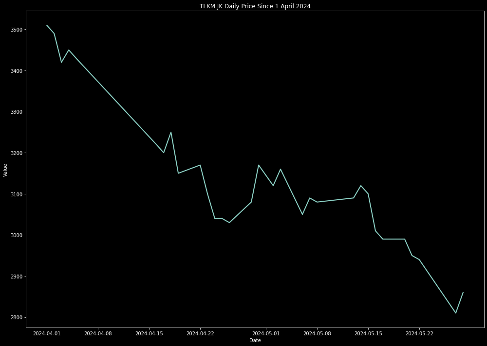
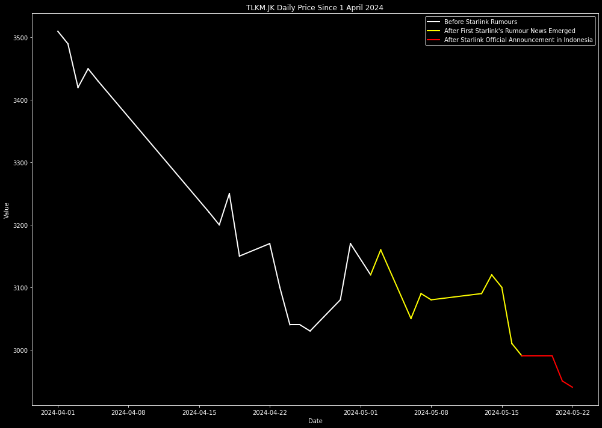

# Analyzing Stock Price Changes: The Impact of Starlink's Arrival in Indonesia

Stock price data provides a valuable time series that allows us to analyze price fluctuations over specific time intervals. From descriptive analytics to predictive models, there are various analyses we can perform. In this article, we'll revisit the basics by examining stock price changes in response to significant events.

## The Moving Average and Beyond

Traders often rely on moving averages to understand trends and make informed decisions. If you're unfamiliar with moving averages, my colleagues have covered them in detail in the [03_simple_moving_average](03_simple_moving_average.md) recipe. However, today, we'll explore a different angle: how stock prices react to specific events.

## Visualizing Price Movements

To analyze stock price changes, we'll create time series plots, assigning distinct colors to each event. This approach makes it easier for users to observe whether stock prices increase or decrease following specific occurrences. Our case study revolves around a recent viral topic in Indonesia: the announcement of Starlink's operational availability in the country.

## The Starlink Impact

While Starlink isn't a direct competitor to all companies, its presence can indirectly affect related industries. Let's focus on a few key players:

1. **TLKM.JK (Telkom Indonesia)**: TLKM.JK provides internet services through brands like Indihome and Telkomsel Orbit. How will their stock price react to Starlink's arrival?

2. **EXCL.JK (XL Axiata)**: EXCL.JK, known for XLHome, faces competition from Starlink. Will their stock price be impacted?

3. **ISAT.JK (Indosat Ooredoo)**: ISAT.JK offers Indosat HIFI services. How will they fare in the wake of Starlink's announcement?

4. **KLBV.JK (First Media)**: KLBV.JK, associated with FirstMedia, is another player in the field. What changes will they experience?

## The Timeline

Our analysis begins with the first rumors of Starlink's availability in Indonesia on early May 2024. We'll then examine stock price movements following the official announcement by the Indonesian government and Elon Musk during an event in Bali on May 19, 2024.

# Data Fetching

Before diving into data fetching and processing, we’ll start by importing the necessary packages for this recipe. The libraries listed below are the ones we’ll be using. If you haven’t already installed them, make sure to do so before proceeding!

```python
import pandas as pd
import datetime
from datetime import timedelta
import requests

import matplotlib.pyplot as plt
```

Our focus today is the **Daily Transaction API Endpoint**. If you haven’t subscribed to the [Sector's API](https://sectors.app/api) yet, don’t hesitate! Visit the [Sector's website](https://sectors.app) and explore the available endpoints and subscribe to their plan. Whether you’re a seasoned trader or a curious data enthusiast, there’s something there for everyone. 

Let’s get practical. Below, you’ll find the code snippet to fetch stock market data from April 1, 2024, until today’s date. Buckle up—we’re about to embark on an exciting journey of exploration and analysis!

```python
df_daily_hist = pd.DataFrame()

api_key = "CHANGE WITH YOUR OWN API KEY"

def get_date_list(start_date):
    start_date = datetime.datetime.strptime(start_date, '%Y-%m-%d')

    end_date = datetime.datetime.today()

    date_list = []

    while start_date < end_date:
        date_list.append(start_date)
        start_date += timedelta(days=90)

    date_list.append(end_date)

    return date_list

date = get_date_list("2024-04-01")

for i in ["TLKM.JK","ISAT.JK","EXCL.JK","KBLV.JK"]:
    for j in range (0,len(date)-1):
        if j==0:
            start_date = date[j]
            start_date = start_date.strftime('%Y-%m-%d')
            
            end_date = date[j+1]
            end_date = end_date.strftime('%Y-%m-%d')
        else:
            start_date = date[j]+ timedelta(days=1)
            start_date = start_date.strftime('%Y-%m-%d')
            
            end_date = date[j+1]
            end_date = end_date.strftime('%Y-%m-%d')

        url = f"https://api.sectors.app/v1/daily/{i}/?start={start_date}&end={end_date}"
        

        headers = {
            "Authorization": api_key
        }

        response = requests.get(url, headers = headers)

        if response.status_code == 200:
            data = response.json()
        else:
            # Handle error
            print(response.status_code)

        df_daily_hist = pd.concat([df_daily_hist,pd.DataFrame(data)])

        print(f"Finsih collect data for stock {i} from {start_date} to {end_date}")
```

Using the code above, we will have a daily transaction data of those 4 companies which we will to do the analysis. Here is the glimpse of the data.

| symbol   | date       | close | volume    | market_cap      |
|----------|------------|-------|-----------|-----------------|
| TLKM.JK  | 2024-04-01 | 3510  | 248116300 | 347708338470912 |
| TLKM.JK  | 2024-04-02 | 3490  | 233071700 | 345727083479040 |
| TLKM.JK  | 2024-04-03 | 3420  |1502657000 | 338792724561920 |
| TLKM.JK  | 2024-04-04 | 3450  | 205184000 | 348760504795136 |
| TLKM.JK  | 2024-04-05 | 3460  | 116057100 | 339783352057856 |

Since the data is already clean enough, we can directly go into the data visualization process.

## Data Visualization

In our Python series, we’ve explored various plotting libraries, with Altair taking center stage. However, today, we’ll diving into the world of Matplotlib in this recipe. Before you ask, there’s no definitive winner between these two packages—it’s all about personal preference and the results you seek.

Below, you’ll find the code snippet to create a line or time series plot for TLKM.JK using Matplotlib. Feel free to experiment and compare the results!

```python
df_tlkm = df_daily_hist[df_daily_hist.symbol == "TLKM.JK"]

plt.figure(figsize=(14, 10))
plt.plot(df_tlkm['date'], df_tlkm['close'], linewidth=2)

# Formatting the plot
plt.xlabel('Date')
plt.ylabel('Value')
plt.title('TLKM.JK Daily Price Since 1 April 2024')
plt.tight_layout()
```
Using the code above, here are the result of the plot.



In the plot above, we visualized TLKM.JK’s stock price movement. However, discerning whether the price increased or decreased after the Starlink rumors and official announcement remains challenging. Fear not! We’ll create a more informative plot—one that color-codes the line segments based on significant events.

Our goal is to highlight key moments in TLKM.JK’s journey. By assigning different colors to specific periods, we’ll make trends more apparent. Buckle up as we dive into the code! Below, you’ll find the code snippet to create a line plot with distinct colors for different events. Let’s unveil the hidden insights:

```python
# Convert date to datetime
df_tlkm['date'] = pd.to_datetime(df_tlkm['date'])

# Define the color change dates
yellow_date = pd.Timestamp('2024-05-02')
red_date = pd.Timestamp('2024-05-19')

# Plotting the data with conditional coloring
plt.style.use('dark_background') 
plt.figure(figsize=(14, 10))

# Plot each segment with the appropriate color
for i in range(len(df_tlkm) - 1):
    start_date = df_tlkm['date'].iloc[i]
    end_date = df_tlkm['date'].iloc[i + 1]
    if end_date > red_date:
        color = 'red'
    elif end_date > yellow_date:
        color = 'yellow'
    else:
        color = 'white'
    
    plt.plot(df_tlkm['date'].iloc[i:i+2], df_tlkm['close'].iloc[i:i+2], color=color, linewidth=2)

# Formatting the plot
plt.xlabel('Date')
plt.ylabel('Value')
plt.title('TLKM.JK Daily Price Since 1 April 2024')
plt.tight_layout()

# Create custom legend
import matplotlib.lines as mlines

blue_line = mlines.Line2D([], [], color='white', linewidth=2, label='Before Starlink Rumours')
yellow_line = mlines.Line2D([], [], color='yellow', linewidth=2, label="After First Starlink's Rumour News Emerged")
red_line = mlines.Line2D([], [], color='red', linewidth=2, label='After Starlink Official Announcement in Indonesia')

plt.legend(handles=[blue_line, yellow_line, red_line])

# Show the plot
plt.show()
```

and here is the plot result of the code above.



In the previous plot, we directly observed TLKM.JK’s price movements following specific events related to Starlink’s announcement. Armed with this information, you can conduct your analysis and make informed trading decisions. But why stop there? Extend this approach to other companies mentioned earlier or explore different events for further insights.

Therefore, don't forget to subscribe to the [Sector's API](https://sectors.app/api) to open more possibility of analysis using the data and endpoints that [Sectors](sectors.app) have! Remember, the stock market is a dynamic arena, and every plot tells a story. Happy analyzing!

